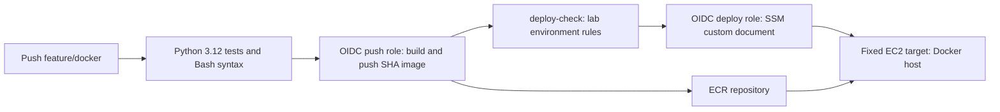
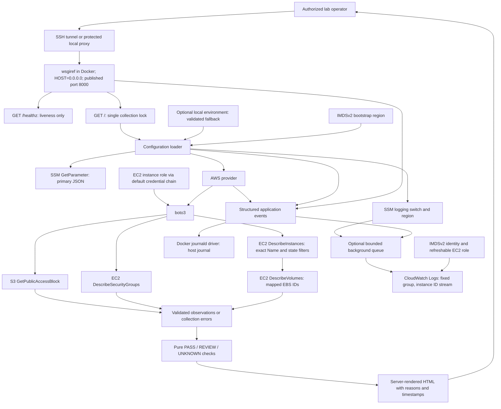

# Architecture and Decision Record

**Status:** AWS provider implemented and tested offline. The operator reports the
previous MVP used systemd; bootstrap now deploys an ECR image on EC2 with Docker and an instance role. This revision
has not been deployed or live-validated by the implementation task. It remains a
single-account learning workload, not a full AWS landing zone or official IDR workload.

## Delivery view

The custom SSM document is external to the repository. Its implementation and
GitHub environment reviewers must be verified separately. Initial host setup is
`bootstrap.sh`; do not assume that the external document executes the same script.
See [deployment details](DEPLOYMENT_EC2.md#ssm-deployment-job).

## Logical view

Health does not read configuration, initialize boto3 clients, acquire the scan
lock, or call AWS. The request threads are standard-library `ThreadingMixIn`;
`wsgiref` and HTML rendering remain. A second simultaneous scan receives 503,
while liveness can respond during a slow first scan. No background scan or cache
is used. CloudWatch log delivery runs on its own worker when enabled; telemetry
failure cannot block scans or health. Alarms and incident exercises remain future
work. See [CloudWatch logging](CLOUDWATCH_LOGS.md).

## Provider and evidence decisions

- Configuration loads the latest SSM JSON per scan, falling back to the complete
  local environment on retrieval/validation failure. Both sources share Settings
  validation. See [configuration guide](PARAMETER_STORE_MIGRATION.md).
- `Settings` validates an explicit region and allowlists; empty
  scope is UNKNOWN and cannot trigger inventory discovery.
- The provider creates a default boto3 Session lazily per scan, with no explicit
  credentials. It reads each bucket and each GroupId separately, isolating API
  failures to a resource. SDK connect/read limits are 3/5 seconds with two total
  attempts; these do not impose a global scan deadline.
- Exactly one matching security group and a complete rule list are required.
  Unexpected continuation tokens, duplicate/wrong groups, missing fields, and
  unsupported source references are UNKNOWN. No partial response is promoted to PASS.
- Each `ALLOWED_INSTANCE_NAME_TAGS` entry adds an EBS Volume Encryption check using
  filtered DescribeInstances followed by DescribeVolumes for the mapped volume IDs.
  Require exactly one non-terminated match, validated Name/state/ID, and no
  continuation token. Zero/multiple matches or partial resolution are UNKNOWN.
  Name resolution repeats per scan so replacement IDs are picked up automatically. All
  attached volumes must have `Encrypted=True` to PASS; any false yields REVIEW
  only when all evidence is complete. Missing/partial data, mismatched attachments,
  API errors, or no volume evidence yield UNKNOWN. Reads are sequential rather than
  atomic; detected attachment changes cannot produce PASS.
- TCP 22/3389 checks include numeric TCP protocol 6 and all-protocol rules.
  UDP-only rules do not trigger this TCP-only criterion. UNKNOWN overrides other
  findings for that resource; remaining resources still retain their own results.
- The page shows actual observation/attempt times, scan ID, and configured region.
  It is a point-in-time snapshot, with no freshness guarantee for an old open tab.
  Empty or unknown evidence is INCOMPLETE; completeness is distinct from compliance.
- The journal records safe category/reason, target ordinal, scan ID, time, and AWS
  request ID. Resource names, raw responses, and raw exception messages are omitted.
  Target order is buckets, groups, then instances. The `api_requests` field retains
  each attempted API operation and its request ID under the same scan correlation ID.

See [application contract and tests](../app/README.md),
[deployment instructions](DEPLOYMENT_EC2.md), and [IAM review](IAM_POLICY_REVIEW.md).

## Application behavior

- Inspect only resources in the personal lab account; initial scope is explicit, not an unrestricted organization-wide scan.
- For S3, bucket-level Block Public Access is only part of effective access evaluation; account/organization settings and policy context matter. Label the check narrowly, and use `UNKNOWN` when effective exposure cannot be established.
- For security groups, flag a selected rule for review when a sensitive management port is open to a broad source; do not assert compromise or full network reachability from one rule.
- A failed AWS API call is a visibility error, not evidence of compliance.
- Show scan time, account/region scope, and check rationale; avoid exposing account identifiers or internal inventory in a public portfolio screenshot.

## Hosting decision

**EC2 selected by the operator:** bootstrap installs Docker and runs a published
ECR image, retaining the instance role. Docker restart policy replaces the old
application systemd service. See [deployment guide](DEPLOYMENT_EC2.md). Direct
Python execution defaults to loopback; bootstrap explicitly binds the container
to `0.0.0.0` and publishes host port 8000 on all interfaces. Keep network access
restricted and use an authenticated tunnel or proxy. No built-in login
is claimed. Compute, storage, public IPv4, and monitoring can incur charges.

**Lambda alternative:** useful for a serverless comparison; requires its own authenticated access and workload-level observability design. A Lambda function URL created for an AWS credit activity is not automatically the same as a secure public dashboard.

The implementation adds no infrastructure or IAM resources. Budget, access-path,
and instance configuration validation remain operator responsibilities. Lambda
remains an alternative, not part of this implementation.

## Terraform boundaries

- Keep the existing S3 learning exercise and its state separate from the new application stack. Never casually move a resource between states.
- Start with local state only for a single-user lab; protect and back it up securely. If collaboration/automation warrants a remote backend, design a dedicated state bucket with versioning and S3 lockfile support; do not assume the application bucket is the backend.
- Use references to express dependencies, e.g., a workload role referenced by the compute resource; use outputs only for useful, non-secret values.
- Review `terraform plan` before applying. A replacement or destroy is a decision point, not routine noise.

## Monitoring model

- **User journey:** representative check retrieval succeeds and is fresh enough for the lab's documented expectation.
- **Application signal:** a health transaction or error/freshness signal; exact implementation and costs must be validated.
- **Infrastructure signal:** EC2 status checks; alarms and notification wiring remain to be validated.
- **Alarm design:** document threshold, evaluation periods, missing-data behavior, notification destination, and test result. Avoid using CPU alone as a proxy for customer impact.
- **Recovery:** verify the user journey, not only a green infrastructure metric.

## Security boundaries

- Dedicated personal account; no employer resources or data.
- Application role: read-only permissions for posture checks plus optional scoped CloudWatch stream/event writes; no administrator permissions, remediation APIs, or embedded access keys.
- Restrict access to the UI/API; log errors without credentials or sensitive response payloads.
- Fault exercises only on tagged, disposable lab resources with a documented rollback.

## Architecture references

- [AWS IDR observability guidance](https://docs.aws.amazon.com/IDR/latest/userguide/observe-idr.html)
- [AWS IDR CloudWatch alarm guidance](https://docs.aws.amazon.com/IDR/latest/userguide/idr-gs-ingest-cw-alarms.html)
- [EC2 status checks](https://docs.aws.amazon.com/AWSEC2/latest/UserGuide/monitoring-system-instance-status-check.html)
- [S3 public access controls](https://docs.aws.amazon.com/AmazonS3/latest/userguide/access-control-block-public-access.html)
- [Terraform S3 backend](https://developer.hashicorp.com/terraform/language/backend/s3)
