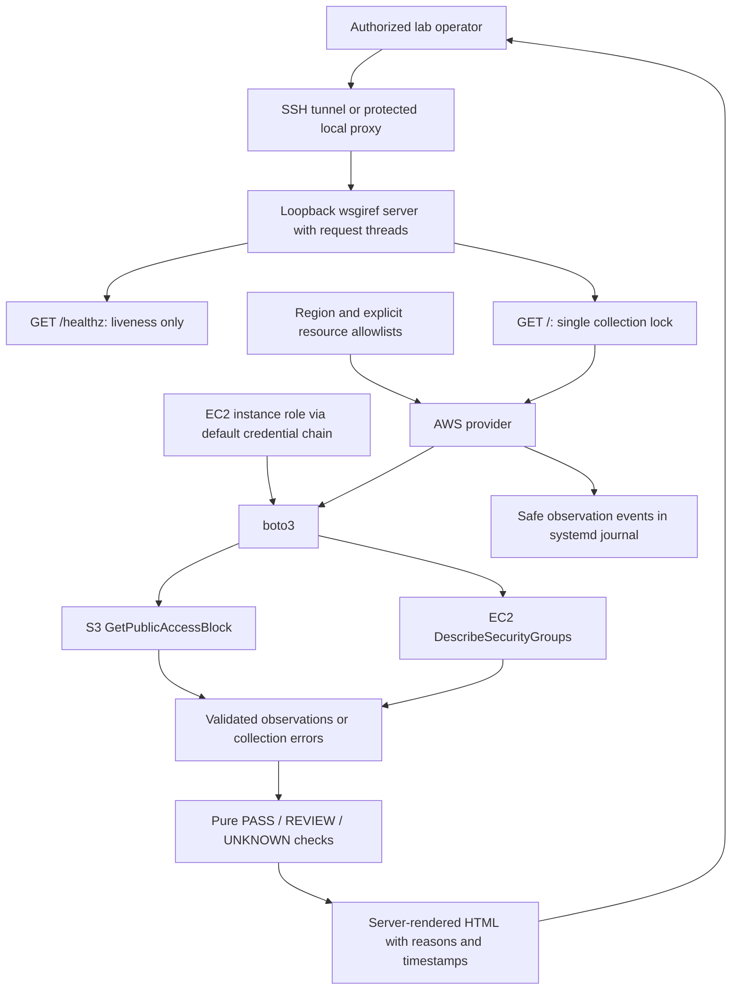

# Architecture and Decision Record

**Status:** AWS provider implemented and tested offline. The operator reports the
previous MVP is deployed on EC2 with systemd and an instance role. This revision
has not been deployed or live-validated by the implementation task. It remains a
single-account learning workload, not a full AWS landing zone or official IDR workload.

## Logical view

Health does not read configuration, initialize boto3 clients, acquire the scan
lock, or call AWS. The request threads are standard-library `ThreadingMixIn`;
`wsgiref` and HTML rendering remain. A second simultaneous scan receives 503,
while liveness can respond during a slow first scan. No background scan or cache
is used. CloudWatch signals, alarms, and incident exercises remain future work.

## Provider and evidence decisions

- `Settings` validates an explicit region and comma-separated allowlists; empty
  scope is UNKNOWN and cannot trigger inventory discovery.
- The provider creates a default boto3 Session lazily per scan, with no explicit
  credentials. It reads each bucket and each GroupId separately, isolating API
  failures to a resource. SDK connect/read limits are 3/5 seconds with two total
  attempts; these do not impose a global scan deadline.
- Exactly one matching security group and a complete rule list are required.
  Unexpected continuation tokens, duplicate/wrong groups, missing fields, and
  unsupported source references are UNKNOWN. No partial response is promoted to PASS.
- TCP 22/3389 checks include numeric TCP protocol 6 and all-protocol rules.
  UDP-only rules do not trigger this TCP-only criterion. UNKNOWN overrides other
  findings for that resource; remaining resources still retain their own results.
- The page shows actual observation/attempt times, scan ID, and configured region.
  It is a point-in-time snapshot, with no freshness guarantee for an old open tab.
  Empty or unknown evidence is INCOMPLETE; completeness is distinct from compliance.
- The journal records safe category/reason, target ordinal, scan ID, time, and AWS
  request ID. Resource names, raw responses, and raw exception messages are omitted.

See [application contract and tests](../app/README.md),
[deployment instructions](DEPLOYMENT_EC2.md), and [IAM review](IAM_POLICY_REVIEW.md).

## Application behavior

- Inspect only resources in the personal lab account; initial scope is explicit, not an unrestricted organization-wide scan.
- For S3, bucket-level Block Public Access is only part of effective access evaluation; account/organization settings and policy context matter. Label the check narrowly, and use `UNKNOWN` when effective exposure cannot be established.
- For security groups, flag a selected rule for review when a sensitive management port is open to a broad source; do not assert compromise or full network reachability from one rule.
- A failed AWS API call is a visibility error, not evidence of compliance.
- Show scan time, account/region scope, and check rationale; avoid exposing account identifiers or internal inventory in a public portfolio screenshot.

## Hosting decision

**EC2 selected by the operator:** existing systemd service and instance role are
retained. The live dashboard stays bound to loopback and requires an authenticated
access path such as SSH forwarding or a protected local proxy. No built-in login
is claimed. Compute, storage, public IPv4, and monitoring can incur charges.

**Lambda alternative:** useful for a serverless comparison; requires its own authenticated access and workload-level observability design. A Lambda function URL created for an AWS credit activity is not automatically the same as a secure public dashboard.

The implementation adds no infrastructure or IAM resources. Budget, access-path,
and instance configuration validation remain operator responsibilities. Lambda
remains an alternative, not part of this implementation.

## Terraform boundaries

- Keep the existing S3 learning exercise and its state separate from the new application stack. Never casually move a resource between states.
- Start with local state only for a single-user lab; protect and back it up securely. If collaboration/automation warrants a remote backend, design a dedicated state bucket with versioning and S3 lockfile support; do not assume the application bucket is the backend.
- Use references to express dependencies, e.g., a workload role referenced by the compute resource; use outputs only for useful, non-secret values.
- Review `terraform plan` before applying. A replacement or destroy is a decision point, not routine noise.

## Monitoring model

- **User journey:** representative check retrieval succeeds and is fresh enough for the lab's documented expectation.
- **Application signal:** a health transaction or error/freshness signal; exact implementation and costs must be validated.
- **Infrastructure signal:** EC2 status checks if EC2 is selected.
- **Alarm design:** document threshold, evaluation periods, missing-data behavior, notification destination, and test result. Avoid using CPU alone as a proxy for customer impact.
- **Recovery:** verify the user journey, not only a green infrastructure metric.

## Security boundaries

- Dedicated personal account; no employer resources or data.
- Application role: read-only permissions required for the two checks; no administrator permissions, mutation APIs, or embedded access keys.
- Restrict access to the UI/API; log errors without credentials or sensitive response payloads.
- Fault exercises only on tagged, disposable lab resources with a documented rollback.

## Architecture references

- [AWS IDR observability guidance](https://docs.aws.amazon.com/IDR/latest/userguide/observe-idr.html)
- [AWS IDR CloudWatch alarm guidance](https://docs.aws.amazon.com/IDR/latest/userguide/idr-gs-ingest-cw-alarms.html)
- [EC2 status checks](https://docs.aws.amazon.com/AWSEC2/latest/UserGuide/monitoring-system-instance-status-check.html)
- [S3 public access controls](https://docs.aws.amazon.com/AmazonS3/latest/userguide/access-control-block-public-access.html)
- [Terraform S3 backend](https://developer.hashicorp.com/terraform/language/backend/s3)
