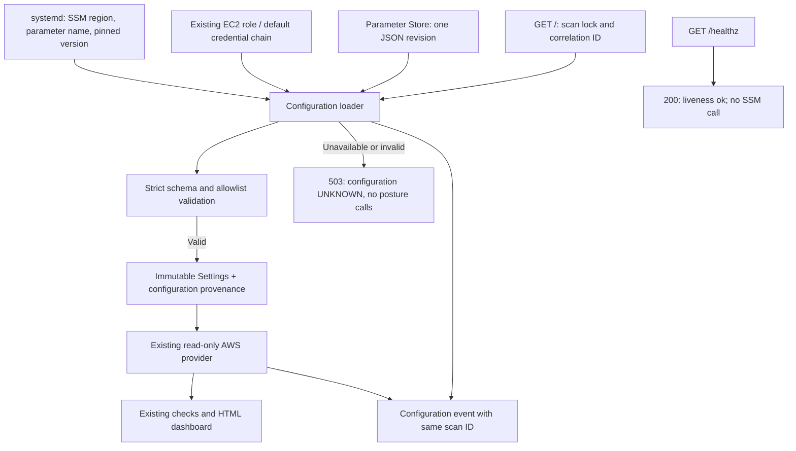

# Parameter Store configuration migration

Status: proposed design only. No application implementation, systemd changes,
parameter creation, IAM updates, or EC2 deployment are performed by this document.
The current runtime still reads `/etc/cloud-security-posture.env`.

## Decision

Store the scan configuration in one versioned JSON `String` parameter:

`/cloud-security-posture-explorer/lab/config`

Read an explicitly pinned numeric version using boto3 `GetParameter`, authenticated
by the existing EC2 instance role. Validate the entire document before collecting
any posture data. Keep wsgiref, HTML rendering, the scan lock, checks, and unittest.

One JSON value keeps region and allowlists in a single revision. Separate mutable
parameters would require an additional version manifest to prevent mixed revisions.
Numeric version pinning makes promotion and rollback explicit; updating Parameter
Store alone will not change the running workload's scan scope.
[GetParameter version selectors](https://docs.aws.amazon.com/systems-manager/latest/APIReference/API_GetParameter.html)



## Parameter schema and local bootstrap

Use Standard tier, `String` type, and `text` data type for these non-secret settings.
Resource identifiers are private operational data: restrict access and do not log
the JSON. This design does not store credentials, tokens, or passwords. If secrets
are introduced later, design `SecureString`/KMS access separately; do not silently
change this loader's type/decryption contract.

Example value (invented identifiers):

```json
{
  "schema_version": 1,
  "aws_region": "us-east-1",
  "allowed_buckets": ["example-personal-lab-bucket"],
  "allowed_security_groups": ["sg-0123456789abcdef0"],
  "allowed_instances": ["i-0123456789abcdef0"]
}
```

All five keys are required. Empty arrays explicitly disable a target category;
at least one array must be nonempty. Reject unknown keys, duplicate JSON keys,
unknown schema versions, non-string resource entries, empty strings, wildcards,
and malformed identifiers. Preserve existing trimming, deduplication, and the
100-unique-identifiers-per-list limit. Do not coerce booleans/numbers into strings.

Validate the UTF-8 serialized size before publication and on retrieval. Standard
parameters have a 4 KB value limit; the existing maximum list lengths do not
guarantee fitting this limit. Never truncate scope. Oversized documents require
an explicit tier/schema decision; Advanced supports 8 KB with different cost and
tier constraints. No automatic tier upgrade is proposed.
[Parameter tiers](https://docs.aws.amazon.com/systems-manager/latest/userguide/parameter-store-advanced-parameters.html)

After implementation, the desired systemd bootstrap would be:

```ini
[Service]
Environment=CONFIG_SOURCE=ssm
Environment=SSM_REGION=us-east-1
Environment=CONFIG_PARAMETER=/cloud-security-posture-explorer/lab/config
Environment=CONFIG_PARAMETER_VERSION=7
Environment=AWS_METADATA_SERVICE_TIMEOUT=2
Environment=AWS_METADATA_SERVICE_NUM_ATTEMPTS=1
```

Version 7 is an example: select the actual reviewed version. These proposed
`CONFIG_*` and `SSM_REGION` variables are not supported by the current code yet.

`SSM_REGION` must be available locally to locate Parameter Store before loading
the scan region. For the initial single-region design, require JSON `aws_region`
to equal `SSM_REGION`; reject mismatches. Pin a simple parameter name in the
selected account/region; no user-supplied URL, cross-account ARN, or HTTP parameter
may select a configuration source. Validate the positive integer version without
accepting labels or an implicit latest version.

Remove `EnvironmentFile=/etc/cloud-security-posture.env` from the effective unit
only during cutover. Keep all current credential isolation settings, metadata
access, loopback binding, service account, working directory, and server command.
Python flags and metadata timeout settings remain local runtime bootstrap; they
are not scan configuration and must not depend on a successful SSM read.

If using a systemd drop-in, an empty `EnvironmentFile=` clears inherited entries;
review the effective unit first so unrelated environment files are not removed.
Do not convert remote JSON to shell commands, `source` it, or interpolate it into
`ExecStart`. Do not use an `ExecStartPre` SSM fetch: a fetch failure would prevent
the server and its independent health endpoint from starting.

## Loading, failures, and freshness

1. Start the WSGI listener without network/configuration retrieval.
2. On GET/HEAD `/`, acquire the existing scan lock and allocate the scan UUID.
3. Select the explicit source. During transition, absent `CONFIG_SOURCE` means
   legacy `env` for backward compatibility. Unknown values fail closed.
4. In `ssm` mode, create an SSM client using the default credential chain and
   explicit bootstrap region. Reuse the current API timeout/retry policy: 3-second
   connect, 5-second read, two total attempts, normal TLS verification, and ignored
   custom service endpoint URL overrides. Metadata credential timeouts are separate.
5. Issue one `GetParameter` for `name:version`, with `WithDecryption=False`.
   Require a complete `Parameter` object, the exact name, the exact positive integer
   version, `Type=String`, `DataType=text`, and a nonempty string value. Validate
   expected ARN region/name if returned; do not infer missing critical fields.
6. Parse and validate all configuration, construct one immutable Settings object,
   and pass it to the existing provider for the entire scan. Do not reread midway.
7. Return the existing result table with safe configuration provenance.

Initially, fetch once per scan, with no disk cache, TTL cache, automatic refresh,
or last-known-good fallback. This keeps the policy easy to audit and ensures a
failed configuration retrieval never silently uses a different scope. One SSM call
per scan is suitable for the current low-volume manual dashboard; revisit caching
only with an explicit stale-data policy and measured request volume.

| Condition | Dashboard / posture behavior | Health |
| --- | --- | --- |
| Valid pinned revision | Existing per-resource checks; same Settings throughout scan | 200 |
| AccessDenied, timeout, throttling, credentials/network error | 503, configuration UNKNOWN; no S3/EC2 posture calls | 200 |
| Missing parameter/version or invalid JSON/schema | 503, configuration UNKNOWN; no posture calls | 200 |
| Empty scope, missing list, wrong type/version/region | 503, configuration UNKNOWN; no posture calls | 200 |
| SSM valid but a resource API fails | Existing per-resource UNKNOWN handling | 200 |
| Another scan holds the lock | Existing 503 + Retry-After | 200 |

Health remains exactly `{"liveness":"ok"}` and never reads SSM or configuration.
On configuration failure, there is no trustworthy resource scope, so display one
configuration-unavailable message rather than inventing resource rows. A later
request can retry the same pinned version after recovery. In `ssm` mode, ignore
all legacy `AWS_REGION`/`ALLOWED_*` scan values; never merge them or fall back to
the env file. Explicit operator rollback is the only route back to env mode.

## IAM and network boundary

Permission design (not a generated/deployed IAM policy):

| Principal | Required access | Scope |
| --- | --- | --- |
| Existing EC2 application role | `ssm:GetParameter` | Exact configuration parameter ARN |
| Configuration publisher/operator | `ssm:PutParameter`, plus `ssm:GetParameter` for verification | Same exact parameter; separate identity from the workload |

Example resource pattern:
`arn:aws:ssm:<REGION>:<ACCOUNT_ID>:parameter/cloud-security-posture-explorer/lab/config`.
The IAM ARN has no `:7` version suffix. Version pinning is a rollout control, not
authorization isolation between versions. Retain the existing S3/EC2 read actions.
No `PutParameter`, delete, history, discovery, or recursive-path read permissions
are needed on the application role. Review all existing attached policies: adding
a narrow allow does not remove broader access already granted elsewhere.
[SSM action/resource mapping](https://docs.aws.amazon.com/service-authorization/latest/reference/list_ssm.html)

Do not add `AmazonSSMManagedInstanceCore` merely to read a parameter. Direct SDK
retrieval does not require SSM Agent, Session Manager, or managed-node registration.
The application needs HTTPS/DNS access to the regional SSM API in addition to its
current endpoints and IMDS. Use the existing outbound route, or evaluate an SSM
interface VPC endpoint with private DNS and restrictive endpoint/security-group
policies if the network is private. No endpoint is created by this design; review
its costs before choosing that route. No KMS decrypt grant is needed for `String`.

Avoid `GetParametersByPath`: only one exact parameter is needed, and hierarchical
access introduces unnecessary scope. If future confidentiality requirements call
for SecureString, explicitly add decryption behavior, a scoped customer-managed
key permission/key policy, and associated failure tests.
[Parameter access guidance](https://docs.aws.amazon.com/systems-manager/latest/userguide/ps-restrict-parameter-access.html)

## Audit and code design

Move correlation-ID creation ahead of configuration retrieval. Emit one
`configuration_load` event with scan ID, source, requested/returned version,
loaded-at UTC time, SSM request ID when available, outcome, and safe error category.
Do not log parameter values, ARNs containing account identifiers, allowlists, or
raw exception messages. Link each existing `posture_observation` to the same scan
ID and configuration source/version; retain its current AWS request correlation.

Show `Configuration: Parameter Store version N` and load time in the dashboard's
existing scan summary. Do not add a config-dump endpoint. Record config failures
locally even when no SSM request ID exists. AWS documents that GetParameter
ParameterNotFound is not recorded in CloudTrail; local failure logging matters.
[GetParameter errors](https://docs.aws.amazon.com/systems-manager/latest/APIReference/API_GetParameter.html)

Proposed implementation boundaries:

- `app/config.py`: shared typed validation and existing env adapter; introduce
  a JSON adapter without joining arrays into lossy comma-separated strings.
- `app/config_provider.py`: env/SSM source selection, version-pinned read, strict
  response validation, sanitized configuration errors, and provenance.
- `app/aws_provider.py`: accept validated Settings and a preallocated scan context;
  preserve all existing posture checks and per-resource error isolation.
- `app/server.py`: resolve configuration only within the scan route and existing
  lock; preserve independent health and show configuration source/version.
- `app/tests/test_config_provider.py`: SDK-stub tests with no live AWS credentials.
- Deployment docs/unit example: bootstrap variables and explicit cutover steps.

## Rollout and rollback

1. Record the current app revision, unit, effective configuration, and a successful
   baseline scan. Retain the env file in a restricted backup outside Git.
2. Implement/test both source adapters; deploy initially in explicit `env` mode.
   Confirm existing scans and health are unchanged.
3. The operator converts the existing three allowlists and region to the complete
   JSON schema, validates size/content, and publishes it as one Standard String
   parameter. Record the returned numeric version; do not assume it is 1.
4. Add the exact-parameter read grant to the instance role through the normal IAM
   change process. Test a candidate load with that role; compare normalized scope
   to the old configuration without logging the actual lists.
5. Update the systemd bootstrap to `ssm` and the reviewed version, remove the old
   EnvironmentFile reference, then daemon-reload and restart. Keep the old file
   privately for the agreed rollback window, but do not load it.
6. Verify health, configuration version in the page/journal, intended resource
   scope, and fresh posture evidence. Exercise a stubbed/unavailable configuration
   scenario and verify health still works with no posture API calls.
7. After acceptance, remove the obsolete env file/backup according to the chosen
   rollback retention. Do not delete or recreate the live parameter name as a
   normal update; retain approved versions needed for rollback and account for
   Parameter Store's version-history retention before pruning/updating repeatedly.

For ordinary configuration changes, publish a new revision, review it, update
`CONFIG_PARAMETER_VERSION`, and restart. Roll back by pinning the previous retained
version and restarting. A pinned numeric version avoids mutable label/latest drift.
Do not grant the application permission to publish its own configuration.

If SSM itself is unavailable, version rollback still depends on SSM. Emergency
rollback instead restores explicit `CONFIG_SOURCE=env` and the retained
EnvironmentFile, then reloads/restarts the unit. If reverting to a pre-migration
binary, restore its entire known-good unit/environment as well. Verify the actual
scan, not only liveness, after either rollback.

## Acceptance tests before cutover

- Valid versioned read maps all fields to the same Settings as the env adapter.
- Empty individual lists work; missing lists/all empty/invalid IDs fail closed.
- Wrong parameter name/version/type, malformed JSON, duplicate keys, unknown schema,
  oversized values, and missing response fields cannot trigger posture calls.
- AccessDenied, missing parameter/version, expired credentials, timeout, and
  throttling yield configuration UNKNOWN without an env or stale-value fallback.
- Exactly one SSM read per scan; no read on `/healthz`, 404, or rejected methods.
- Health responds during a blocked SSM read; the single-scan limit still applies.
- Configuration and posture events share the scan ID; logs contain no values.
- Explicit source/version changes and both rollback paths behave as documented.
- Existing S3, security group, EBS encryption, and health tests continue to pass.

No automated tests were changed or run for this design-only document. Live access,
IAM, networking, and rollout validation remain implementation acceptance work.
